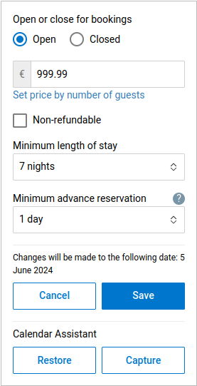

# Calendar Assistant for Booking.com

  

The Calendar Assistant for Booking.com is a userscript designed to enhance the calendar interface
for property managers. This tool introduces "Capture" and "Restore" functionalities, making it
easier to manage pricing and availability settings across different properties or time periods. It
streamlines the process of adjusting for seasonal rate variations and booking conditions,
significantly reducing the need for repetitive manual entries.

## Features

- Capture State: Allows users to save the current state of a property's pricing and availability
  settings.
- Restore State: Enables users to apply previously saved settings to the same or different
  properties, facilitating easy management of rates and availability across various times and
  listings.

## Installation

1. To use the Calendar Assistant, you must have a userscript manager installed on your
   browser. Greasemonkey (for
   [Firefox](https://addons.mozilla.org/en-GB/firefox/addon/greasemonkey/) users) and Tampermonkey
   (for users of
   [Chrome](https://chromewebstore.google.com/detail/tampermonkey/dhdgffkkebhmkfjojejmpbldmpobfkfo)
   and other browsers) are popular userscript manager addons that allow you to add custom scripts to
   web pages. Install Greasemonkey or Tampermonkey from your browser's extension store.
1. Once the userscript manager is installed, create a new userscript within it. This is usually done
   through the extension's dashboard or toolbar icon.
1. Open the
   [bookingdotcom-calendar-assistant.js](https://raw.githubusercontent.com/midsbie/bookingdotcom-calendar-assistant/master/bookingdotcom-calendar-assistant.js)
   userscript in a new tab.
1. Copy the entire contents of the `bookingdotcom-calendar-assistant.js` script.
1. Return to the userscript manager and paste the copied script into the **new userscript**
   area.
1. Save the script and ensure it's enabled in the userscript manager’s dashboard.
1. If you had any Booking.com calendar interface tabs open prior to installing the script, please
   reload them to activate the Calendar Assistant functionalities.

## Usage

Once installed, navigate to the calendar interface on the Booking.com property management page. You
will notice two new buttons added to the interface: `Capture` and `Restore`.

- To save the current settings, click on `Capture`. This will store the pricing and availability
  settings. Note that the button will be disabled unless a price has been entered and the calendar
  is open for bookings.
- To apply saved settings to the calendar, click on `Restore`. This action will load the previously
  captured settings into the current view.

Note that your captured data is stored locally in your browser's storage and is not shared or
accessible by third-parties.

### Example Use

The following instructions assume you have installed the userscript on your browser.

1. Navigate to the Booking.com group home page or property management page.
1. Open the calendars for all the properties you would like to make changes to.
1. On the first calendar:
   1. Choose the specific month and dates you want to adjust settings for.
   1. Ensure that the selected dates are open for new bookings. If closed, click on the `Open`
      checkbox.
   1. Enter the desired price for the selected time period.
   1. Select the applicable minimum length of stay.
   1. Select the minimum advance reservation.
   1. After adjusting all necessary settings, click on the `Capture` button. This saves your current
      setup for later use.
   1. Click on `Save` to apply your changes to the property, if applicable.
1. For every other property:
   1. Switch to the browser tab where you have the calendar of the next property open.
   1. Choose the time period to which you want to apply the previously captured settings.
   1. Click on the Restore button to load the settings you captured from the first property.
   1. Check to ensure that the pricing and availability details are correctly filled in and match
      your expectations.
   1. Once you've confirmed that all details are correct, click on Save to finalize the changes for
      this property.

## Limitations

The script is designed to work with specific URL patterns on Booking.com and may not activate on
pages outside the specified paths. Additionally, since it works by interacting directly with the
Booking.com calendar interface, it relies on the stability of the website's design. Changes to the
website may affect the script's functionality.

## Contributing

Contributions are what make the open-source community such an amazing place to learn, inspire, and
create. All contributions are greatly appreciated.

## License

Distributed under the MIT License. See LICENSE for more information.
